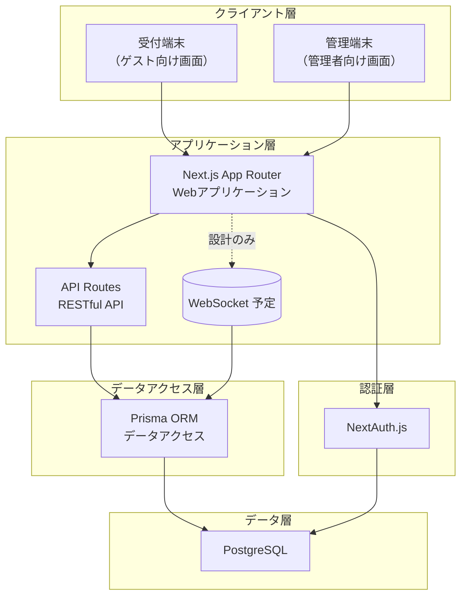
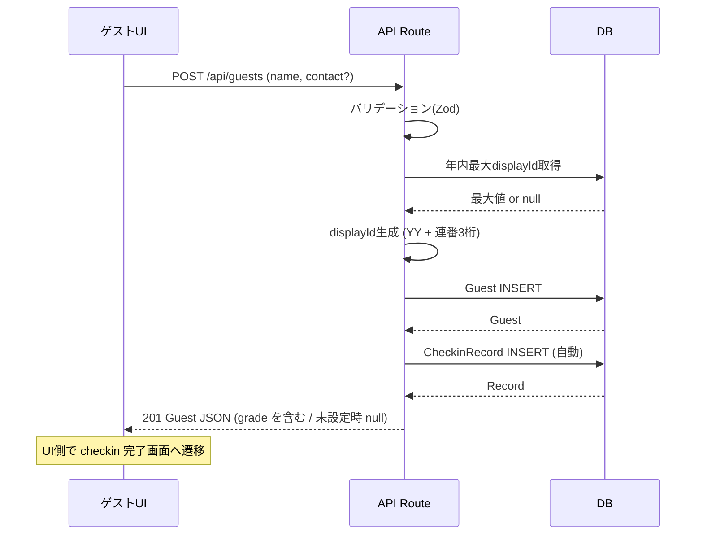
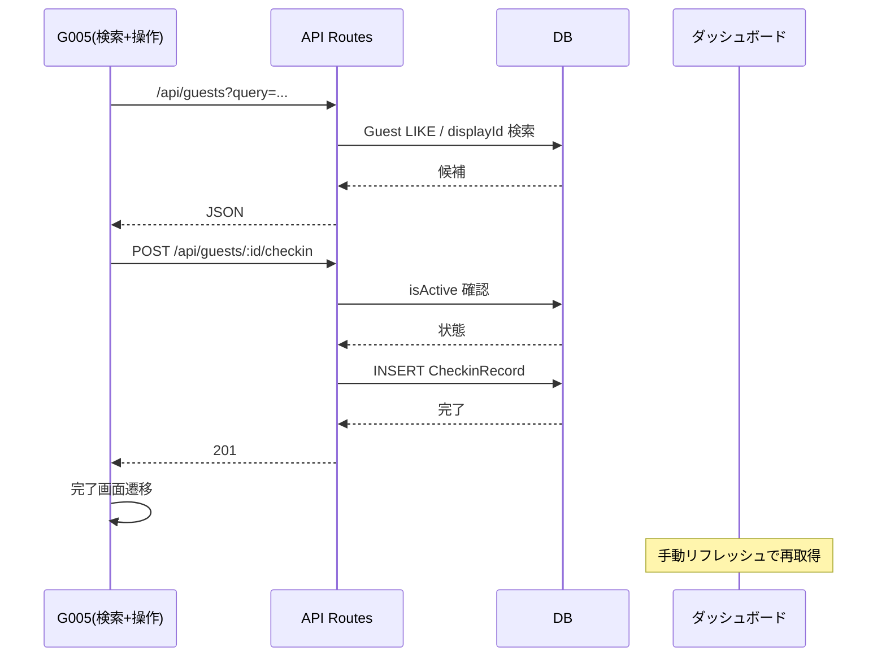
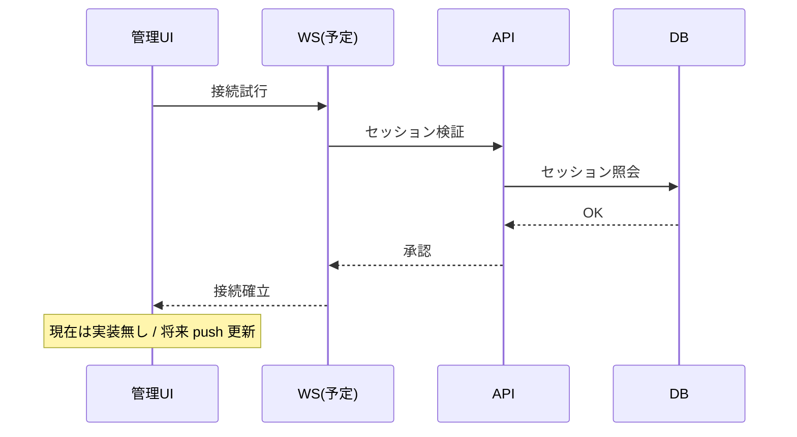

# システムアーキテクチャ設計書

**最終更新日:** 2025 年 9 月 14 日

---

## 1. 全体アーキテクチャ概要

### 1.1. アーキテクチャ構成図



### 1.2. 技術スタック

| 層             | 技術                      | 理由                               |
| -------------- | ------------------------- | ---------------------------------- |
| フロントエンド | Next.js 14 (App Router)   | SSR/SSG / ルーティング一体化       |
| UI/UX          | Tailwind CSS + shadcn/ui  | 開発効率 / 一貫性                  |
| バックエンド   | Next.js API Routes        | 単一リポジトリ運用容易             |
| データベース   | PostgreSQL                | ACID / 拡張性                      |
| ORM            | Prisma                    | 型安全 / Migration 管理            |
| 認証           | NextAuth.js (Credentials) | セッション管理標準化               |
| バリデーション | Zod                       | 入力/型統一                        |
| リアルタイム   | WebSocket/SSE (予定)      | 現在未実装（Poll → Push 移行予定） |

## 2. ディレクトリ構成

### 2.1. 実際の構成（2025-09-14 現在）

```
src/app/(guest)/page.tsx            # G001 トップ
src/app/(guest)/terms/page.tsx       # G002 利用規約
src/app/(guest)/register/page.tsx    # G003 登録
src/app/(guest)/register/complete    # G004 完了
src/app/(guest)/checkin/page.tsx     # G005 検索+操作統合 (旧G006統合)
src/app/(guest)/checkin/complete     # G007 入退場完了
src/app/(admin)/login/page.tsx       # A001 ログイン
src/app/(admin)/dashboard/page.tsx   # A002 ダッシュボード（手動更新）
src/app/(admin)/history/page.tsx     # A003 履歴
src/app/(admin)/guests/page.tsx      # A004 ゲスト管理（モーダル編集）
```

（A005 ゲスト詳細ページは未実装 / 現状不要）

### 2.2. 差異メモ

| 項目      | 旧ドキュメント      | 現状             | 備考                            |
| --------- | ------------------- | ---------------- | ------------------------------- |
| G005/G006 | 分離                | G005 に統合      | `CheckinActions` コンポーネント |
| A005      | 独立ページ          | 未実装           | モーダル編集で代替              |
| 自動更新  | ダッシュボード 5 秒 | 手動リフレッシュ | 今後ポーリング予定              |

## 3. ドメインフロー

### 3.1. 新規登録 + 自動チェックイン



### 3.2. 入退場操作（単一ページ）



### 3.3. リアルタイム設計（未実装）



## 4. セキュリティ / 認証

（省略せず現状維持 + レート制限未実装）

## 5. パフォーマンス要点

- 現状インデックス未整備: `Guest.name`, `CheckinRecord.isActive`, `CheckinRecord.checkinAt`, `(guestId,isActive)`
- 早期マイグレーション推奨（データ少量の段階）
- 学年 (`Guest.grade`) は初期はインデックス不要。学年別集計をダッシュボードへ追加する段階で検討。

## 6. ドメインモデル追加属性

| エンティティ | フィールド | 型    | 説明 | 備考                            |
| ------------ | ---------- | ----- | ---- | ------------------------------- |
| Guest        | grade      | Enum? | 学年 | ES1..ES6/JH1..JH3/HS1..HS3/NULL |

### 6.1. grade モデル設計メモ

- 目的: 年齢帯ごとの利用状況分析・将来の活動ログ粒度向上。
- NULL 許容理由: 既存データ移行簡略化 + 任意入力維持 + 卒業後保持ケース。
- 進級処理（将来）: 年度切替ジョブ (idempotent) で内部マッピング表に基づき更新。HS3→NULL。
- ロールバック: 非破壊追加のため DROP COLUMN+TYPE で戻せる（他オブジェクト依存なしを前提）。
- API: `grade` は常にレスポンスに含む（未設定時 `null`）。

## 6. ログ / オブザーバビリティ

- 監査ログ未実装（履歴編集機能導入前に方針確定要）

## 7. 将来拡張優先順 (推奨)

1. ダッシュボード短周期ポーリング (5–10s)
2. インデックス追加 Migration
3. 履歴編集/追加 + 監査ログ
4. レート制限 / メトリクス
5. WebSocket/SSE 導入
6. エクスポート / QR / 通知

## 8. 変更履歴

| 日付       | 区分 | 内容                                                                           |
| ---------- | ---- | ------------------------------------------------------------------------------ |
| 2025-09-14 | 修正 | grade Enum 追加反映 / current-guests 公開エンドポイント注記 / users API 追記   |
| 2025-09-06 | 修正 | G005+G006 統合 / A005 未実装明示 / 自動チェックインフロー追加 / 将来優先度整理 |
| 2025-07-03 | 初版 | 初期作成                                                                       |
