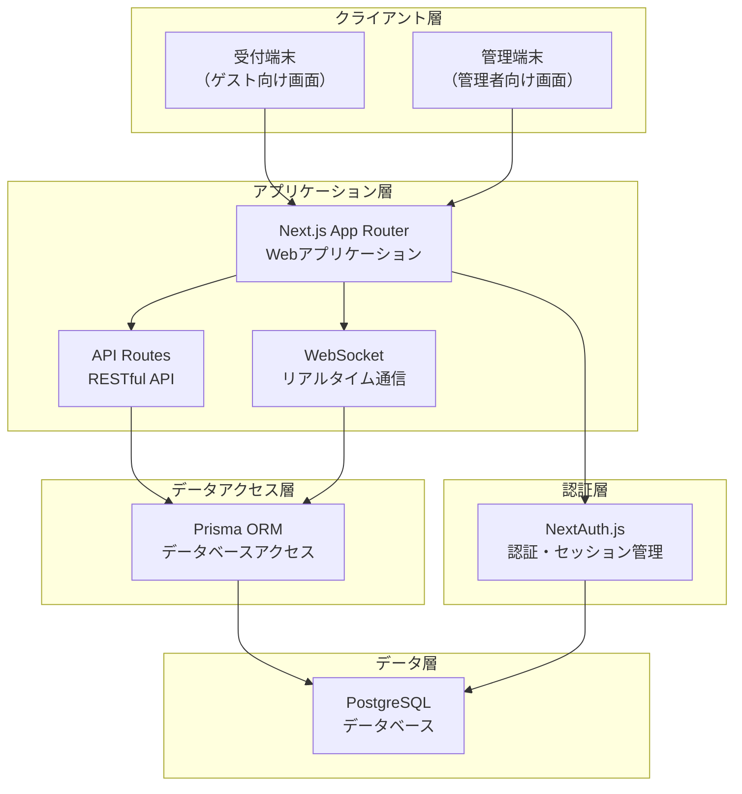
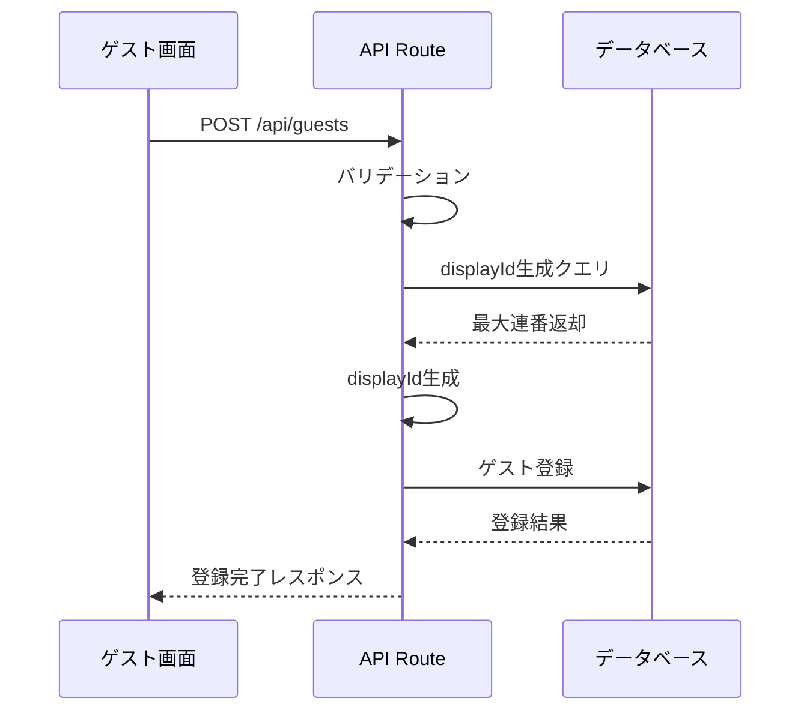
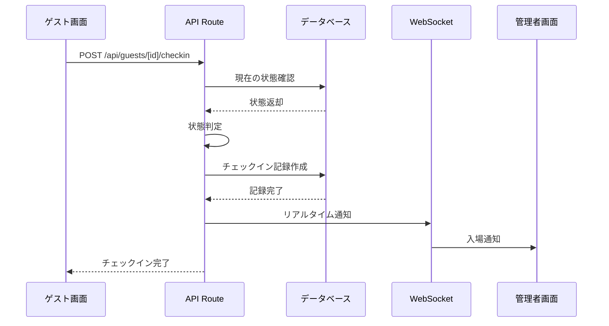
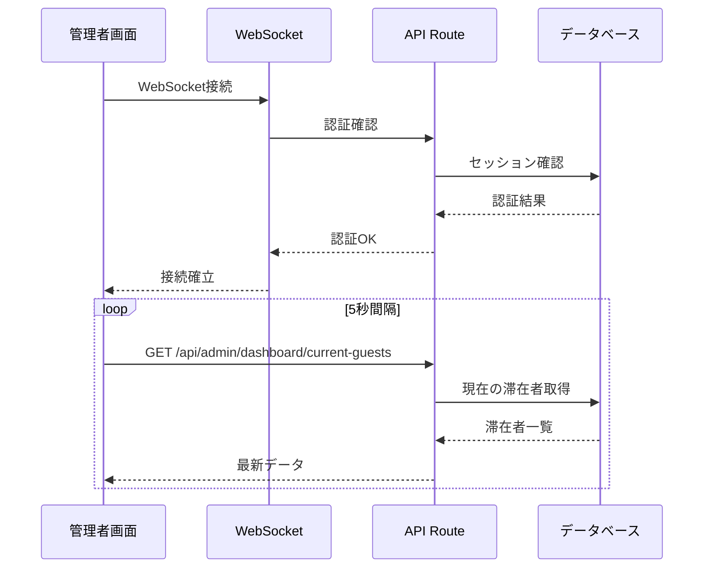
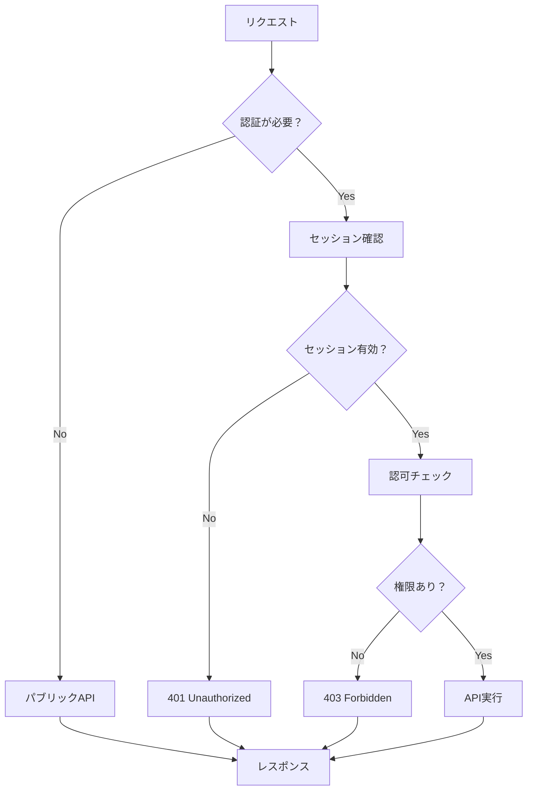

# システムアーキテクチャ設計書

**最終更新日:** 2025 年 7 月 3 日

---

## 1. 全体アーキテクチャ概要

### 1.1. アーキテクチャ構成図



### 1.2. 技術スタック

| 層             | 技術                     | 理由                                  |
| -------------- | ------------------------ | ------------------------------------- |
| フロントエンド | Next.js 14 (App Router)  | SSR/SSG 対応、TypeScript 標準サポート |
| UI/UX          | Tailwind CSS + shadcn/ui | 高速開発、一貫性のあるデザイン        |
| バックエンド   | Next.js API Routes       | フルスタック開発、デプロイ簡素化      |
| データベース   | PostgreSQL               | 高信頼性、ACID 特性、スケーラビリティ |
| ORM            | Prisma                   | 型安全性、マイグレーション管理        |
| 認証           | NextAuth.js              | セキュリティベストプラクティス        |
| リアルタイム   | WebSocket (ws)           | 低遅延での双方向通信                  |
| バリデーション | Zod                      | 型安全なスキーマ定義                  |
| 開発環境       | TypeScript               | 型安全性、開発効率向上                |

## 2. ディレクトリ構成

### 2.1. プロジェクト構成

```
tecnova-checkin-system/
├── docs/                      # ドキュメント
│   ├── REQUIREMENTS.md        # 要件定義書
│   ├── DATABASE_DESIGN.md     # データベース設計書
│   ├── SCREEN_DESIGN.md       # 画面遷移設計書
│   ├── API_DESIGN.md          # API設計書
│   └── ARCHITECTURE.md        # アーキテクチャ設計書
├── prisma/                    # データベース関連
│   ├── schema.prisma          # スキーマ定義
│   ├── migrations/            # マイグレーションファイル
│   └── seed.ts                # 初期データ投入
├── src/                       # ソースコード
│   ├── app/                   # Next.js App Router
│   │   ├── (guest)/          # ゲスト向け画面
│   │   │   ├── page.tsx      # トップ画面
│   │   │   ├── register/     # 新規登録フロー
│   │   │   └── checkin/      # 入退場フロー
│   │   ├── (admin)/          # 管理者向け画面
│   │   │   ├── login/        # ログイン
│   │   │   ├── dashboard/    # ダッシュボード
│   │   │   ├── history/      # 履歴
│   │   │   └── guests/       # ゲスト管理
│   │   ├── api/              # API Routes
│   │   │   ├── auth/         # 認証関連
│   │   │   ├── guests/       # ゲスト関連
│   │   │   └── admin/        # 管理者関連
│   │   ├── globals.css       # グローバルスタイル
│   │   └── layout.tsx        # ルートレイアウト
│   ├── components/           # UIコンポーネント
│   │   ├── ui/               # shadcn/ui基本コンポーネント
│   │   ├── guest/            # ゲスト向けコンポーネント
│   │   ├── admin/            # 管理者向けコンポーネント
│   │   └── common/           # 共通コンポーネント
│   ├── lib/                  # ユーティリティ・設定
│   │   ├── auth.ts           # 認証設定
│   │   ├── db.ts             # データベース接続
│   │   ├── validations.ts    # バリデーションスキーマ
│   │   └── utils.ts          # ユーティリティ関数
│   └── types/                # TypeScript型定義
│       ├── guest.ts          # ゲスト関連型
│       ├── checkin.ts        # チェックイン関連型
│       └── api.ts            # API関連型
├── public/                   # 静的ファイル
│   ├── images/               # 画像ファイル
│   └── icons/                # アイコンファイル
├── .env.local                # 環境変数（ローカル）
├── .env.example              # 環境変数サンプル
├── package.json              # 依存関係
├── tailwind.config.js        # Tailwind設定
├── next.config.js            # Next.js設定
├── tsconfig.json             # TypeScript設定
└── README.md                 # プロジェクト説明
```

### 2.2. 画面別ディレクトリ詳細

#### ゲスト向け画面 (`app/(guest)/`)

```
(guest)/
├── page.tsx                  # G001: トップ画面
├── terms/
│   └── page.tsx             # G002: 利用規約同意画面
├── register/
│   ├── page.tsx             # G003: 新規登録画面
│   └── complete/
│       └── page.tsx         # G004: 登録完了画面
├── checkin/
│   ├── page.tsx             # G005: 入退場画面（検索）
│   ├── [id]/
│   │   └── page.tsx         # G006: 入退場操作画面
│   └── complete/
│       └── page.tsx         # G007: 操作完了画面
└── layout.tsx               # ゲスト向けレイアウト
```

#### 管理者向け画面 (`app/(admin)/`)

```
(admin)/
├── login/
│   └── page.tsx             # A001: ログイン画面
├── dashboard/
│   └── page.tsx             # A002: ダッシュボード
├── history/
│   └── page.tsx             # A003: 入退場履歴画面
├── guests/
│   ├── page.tsx             # A004: ゲスト管理画面
│   └── [id]/
│       └── page.tsx         # A005: ゲスト詳細・編集画面
└── layout.tsx               # 管理者向けレイアウト
```

## 3. データフロー

### 3.1. ゲスト新規登録フロー



### 3.2. チェックイン/アウトフロー



### 3.3. リアルタイム更新フロー



## 4. セキュリティアーキテクチャ

### 4.1. 認証・認可フロー



### 4.2. セキュリティ対策

| 脅威                 | 対策               | 実装             |
| -------------------- | ------------------ | ---------------- |
| SQL インジェクション | ORM 使用           | Prisma           |
| XSS                  | サニタイゼーション | Next.js 標準     |
| CSRF                 | CSRF トークン      | NextAuth.js      |
| セッション乗っ取り   | セキュアクッキー   | httpOnly, secure |
| 機密情報漏洩         | 環境変数管理       | .env.local       |
| API の不正利用       | レート制限         | 独自実装         |

## 5. パフォーマンス設計

### 5.1. フロントエンド最適化

| 項目         | 対策               | 実装方法           |
| ------------ | ------------------ | ------------------ |
| 初期読み込み | SSR/SSG            | Next.js App Router |
| 画像最適化   | 自動最適化         | next/image         |
| コード分割   | 自動分割           | Next.js 標準       |
| キャッシュ   | ブラウザキャッシュ | Cache-Control      |

### 5.2. バックエンド最適化

| 項目               | 対策             | 実装方法          |
| ------------------ | ---------------- | ----------------- |
| データベースクエリ | インデックス     | Prisma schema     |
| 接続プール         | 接続数制限       | Prisma 設定       |
| キャッシュ         | メモリキャッシュ | Redis（将来拡張） |
| レスポンス圧縮     | gzip             | Next.js 標準      |

## 6 将来拡張への対応

1. **QR コード対応**

   - Guest.id（UUID）を QR コードとして利用
   - 新しいチェックイン方法の追加

2. **保護者通知**

   - 通知サービスの抽象化
   - メール/SMS 送信機能の追加

3. **データ分析**

   - 分析用データマートの構築
   - BI ツールとの連携

4. **マルチテナント**
   - 施設別データの分離
   - 権限管理の拡張
