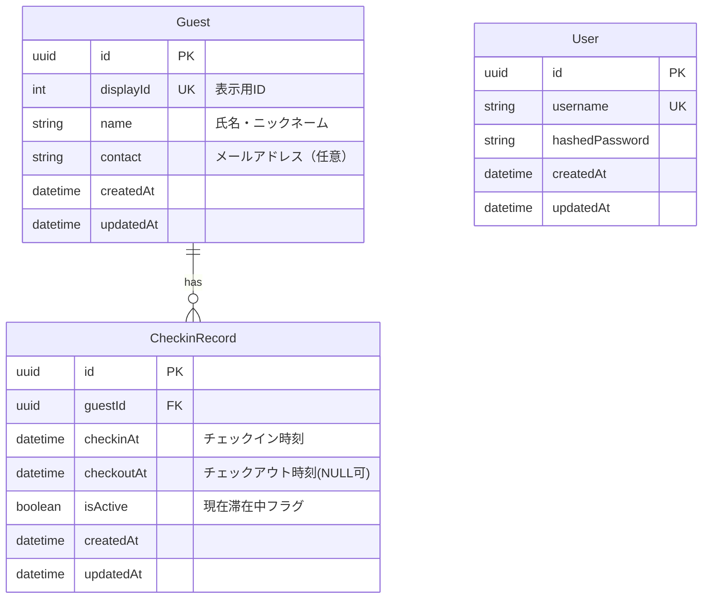

# データベース設計書

**最終更新日:** 2025 年 7 月 3 日

---

## 1. ER 図



## 2. テーブル詳細設計

### 2.1. User（管理者）テーブル

| カラム名       | データ型     | 制約                    | 説明                       |
| -------------- | ------------ | ----------------------- | -------------------------- |
| id             | UUID         | PRIMARY KEY             | 主キー                     |
| username       | VARCHAR(50)  | UNIQUE, NOT NULL        | ログイン ID                |
| hashedPassword | VARCHAR(255) | NOT NULL                | ハッシュ化されたパスワード |
| createdAt      | TIMESTAMP    | NOT NULL, DEFAULT NOW() | 作成日時                   |
| updatedAt      | TIMESTAMP    | NOT NULL, DEFAULT NOW() | 更新日時                   |

**インデックス:**

- PRIMARY KEY (id)
- UNIQUE INDEX (username)

### 2.2. Guest（ゲスト）テーブル

| カラム名  | データ型     | 制約                    | 説明                    |
| --------- | ------------ | ----------------------- | ----------------------- |
| id        | UUID         | PRIMARY KEY             | 主キー（QR コード用）   |
| displayId | INTEGER      | UNIQUE, NOT NULL        | 表示用 ID（YYXXX 形式） |
| name      | VARCHAR(100) | NOT NULL                | 氏名・ニックネーム      |
| contact   | VARCHAR(255) | NULL                    | メールアドレス（任意）  |
| createdAt | TIMESTAMP    | NOT NULL, DEFAULT NOW() | 登録日時                |
| updatedAt | TIMESTAMP    | NOT NULL, DEFAULT NOW() | 更新日時                |

**インデックス:**

- PRIMARY KEY (id)
- UNIQUE INDEX (displayId)
- INDEX (name) - 検索用

**備考:**

- displayId は `YYXXX` 形式（例: 25001, 25002）
- YY: 年（2025 → 25）
- XXX: 年内の連番（001 から 999 まで）
- name はニックネーム可

### 2.3. CheckinRecord（入退場記録）テーブル

| カラム名   | データ型  | 制約                    | 説明               |
| ---------- | --------- | ----------------------- | ------------------ |
| id         | UUID      | PRIMARY KEY             | 主キー             |
| guestId    | UUID      | FOREIGN KEY, NOT NULL   | ゲスト ID          |
| checkinAt  | TIMESTAMP | NOT NULL                | チェックイン時刻   |
| checkoutAt | TIMESTAMP | NULL                    | チェックアウト時刻 |
| isActive   | BOOLEAN   | NOT NULL, DEFAULT TRUE  | 現在滞在中フラグ   |
| createdAt  | TIMESTAMP | NOT NULL, DEFAULT NOW() | 作成日時           |
| updatedAt  | TIMESTAMP | NOT NULL, DEFAULT NOW() | 更新日時           |

**外部キー制約:**

- guestId REFERENCES Guest(id) ON DELETE CASCADE

**インデックス:**

- PRIMARY KEY (id)
- INDEX (guestId)
- INDEX (checkinAt)
- INDEX (isActive)
- INDEX (guestId, isActive) - 複合インデックス

**備考:**

- isActive = TRUE: 現在滞在中
- isActive = FALSE: 退場済み
- checkoutAt = NULL: 滞在中

## 3. ビジネスルール

### 3.1. DisplayID 生成ルール

```typescript
// 表示用ID生成ロジック
const generateDisplayId = (sequence: number): number => {
  const year = new Date().getFullYear().toString().slice(-2); // YY
  const sequenceStr = sequence.toString().padStart(3, "0"); // XXX

  return parseInt(`${year}${sequenceStr}`);
};

// 年ごとの次の連番を取得
const getNextSequenceForYear = async (year: number): Promise<number> => {
  const yearPrefix = year.toString().slice(-2);

  // 該当年のdisplayIdの最大値を取得
  const maxDisplayId = await prisma.guest.findFirst({
    where: {
      displayId: {
        gte: parseInt(`${yearPrefix}000`),
        lt: parseInt(
          `${(parseInt(yearPrefix) + 1).toString().padStart(2, "0")}000`
        ),
      },
    },
    orderBy: {
      displayId: "desc",
    },
  });

  if (!maxDisplayId) {
    return 1; // 該当年の最初のゲスト
  }

  // 現在の最大displayIdから連番部分を抽出
  const currentSequence = maxDisplayId.displayId % 1000;
  return currentSequence + 1;
};
```

### 3.2. チェックイン/アウト制御

- 同一ゲストの重複チェックイン防止
- チェックアウト時は対応する isActive=TRUE のレコードを更新
- 未チェックアウトのレコードがある場合のハンドリング

### 3.3. データ整合性

- ゲスト削除時は関連するチェックイン記録も削除（CASCADE）
- チェックイン時刻 ≤ チェックアウト時刻の制約
- 同一ゲストで isActive=TRUE のレコードは最大 1 件

## 4. パフォーマンス考慮事項

### 4.1. 想定データ量

- ゲスト数: 500 人程度
- 1 日あたりの入退場記録: 100-200 回
- 年間の入退場記録: 36,000-72,000 件

### 4.2. クエリ最適化

**頻繁に実行されるクエリ:**

1. **現在の滞在者一覧取得**

```sql
SELECT g.name, cr.checkinAt
FROM Guest g
JOIN CheckinRecord cr ON g.id = cr.guestId
WHERE cr.isActive = TRUE
ORDER BY cr.checkinAt DESC;
```

2. **ゲスト検索（名前）**

```sql
SELECT id, displayId, name
FROM Guest
WHERE name LIKE '%検索語%'
ORDER BY name;
```

3. **入退場履歴検索**

```sql
SELECT g.name, cr.checkinAt, cr.checkoutAt
FROM CheckinRecord cr
JOIN Guest g ON cr.guestId = g.id
WHERE DATE(cr.checkinAt) = '2025-07-03'
ORDER BY cr.checkinAt DESC;
```
