# 画面遷移設計書

**最終更新日:** 2025 年 7 月 3 日

---

## 1. 全体画面構成

### 1.1. 画面一覧

**ゲスト向け画面（受付端末）**

- G001: トップ画面（ゲスト選択）
- G002: 利用規約同意画面
- G003: 新規登録画面
- G004: 登録完了画面
- G005: 入退場画面（ゲスト検索）
- G006: 入退場操作画面
- G007: 操作完了画面

**管理者向け画面（管理端末）**

- A001: ログイン画面
- A002: ダッシュボード（メイン）
- A003: 入退場履歴画面
- A004: ゲスト管理画面
- A005: ゲスト詳細・編集画面

## 2. 詳細画面遷移図

```mermaid
graph TD
    %% ゲスト向け画面フロー
    subgraph "ゲスト向け画面"
        G001[G001: トップ画面]
        G002[G002: 利用規約同意]
        G003[G003: 新規登録]
        G004[G004: 登録完了]
        G005[G005: 入退場画面]
        G006[G006: 入退場操作]
        G007[G007: 操作完了]
    end

    %% 管理者向け画面フロー
    subgraph "管理者向け画面"
        A001[A001: ログイン]
        A002[A002: ダッシュボード]
        A003[A003: 入退場履歴]
        A004[A004: ゲスト管理]
        A005[A005: ゲスト詳細・編集]
    end

    %% ゲスト画面の遷移
    G001 -->|"はじめての方"| G002
    G001 -->|"メンバーの方"| G005
    G002 -->|"同意する"| G003
    G002 -->|"同意しない"| G001
    G003 -->|"登録"| G004
    G003 -->|"キャンセル"| G001
    G004 -->|"チェックインする"| G005
    G004 -->|"トップに戻る"| G001
    G005 -->|"ゲスト選択"| G006
    G005 -->|"戻る"| G001
    G006 -->|"チェックイン/アウト"| G007
    G006 -->|"戻る"| G005
    G007 -->|"完了"| G001

    %% 管理者画面の遷移
    A001 -->|"ログイン成功"| A002
    A002 -->|"履歴を見る"| A003
    A002 -->|"ゲスト管理"| A004
    A003 -->|"戻る"| A002
    A004 -->|"戻る"| A002
    A004 -->|"ゲスト選択"| A005
    A005 -->|"戻る"| A004
    A005 -->|"削除後"| A004

    %% ログアウト
    A002 -->|"ログアウト"| A001
    A003 -->|"ログアウト"| A001
    A004 -->|"ログアウト"| A001
    A005 -->|"ログアウト"| A001
```

## 3. 画面詳細設計

### 3.1. ゲスト向け画面

#### G001: トップ画面（ゲスト選択）

**目的**: ゲストの利用区分を選択
**レイアウト**: 大きなボタン 2 つを縦に配置

**UI 要素**:

- タイトル: "tec-nova へようこそ！"
- ボタン 1: "はじめての方（新規登録）"
- ボタン 2: "メンバーの方（入退場）"
- 装飾: 子供向けアイコン・イラスト

**アクション**:

- "はじめての方" → G002（利用規約同意）
- "メンバーの方" → G005（入退場画面）

#### G002: 利用規約同意画面

**目的**: 新規登録前の利用規約同意
**レイアウト**: 規約テキスト + 同意チェックボックス + ボタン

**UI 要素**:

- タイトル: "利用規約"
- 規約テキスト（スクロール可能）
- 同意チェックボックス: "規約に同意します"
- ボタン: "同意して次へ"（チェック必須）
- ボタン: "戻る"

**アクション**:

- "同意して次へ" → G003（新規登録）
- "戻る" → G001（トップ画面）

#### G003: 新規登録画面

**目的**: ゲストの基本情報を登録
**レイアウト**: フォーム形式

**UI 要素**:

- タイトル: "新しいメンバー登録"
- 入力フィールド 1: "お名前（ニックネーム可）" ※必須
- 入力フィールド 2: "メールアドレス（任意）"
- ボタン: "登録する"
- ボタン: "キャンセル"

**バリデーション**:

- 名前: 必須、1-50 文字
- メールアドレス: 任意、有効なメールアドレス形式

**アクション**:

- "登録する" → G004（登録完了）
- "キャンセル" → G001（トップ画面）

#### G004: 登録完了画面

**目的**: 登録完了と発行された ID の表示
**レイアウト**: 完了メッセージ + ID 表示 + 次のアクション

**UI 要素**:

- タイトル: "登録完了！"
- メッセージ: "あなたの ID は [XXX] です"
- 説明: "この ID は次回から使用できます"
- ボタン: "チェックインする"
- ボタン: "トップに戻る"

**アクション**:

- "チェックインする" → G005（入退場画面）
- "トップに戻る" → G001（トップ画面）

#### G005: 入退場画面（ゲスト検索）

**目的**: 登録済みゲストの検索・選択
**レイアウト**: 検索フォーム + 検索結果リスト

**UI 要素**:

- タイトル: "誰ですか？"
- 検索フォーム: "お名前または ID で検索"
- 検索結果リスト: 名前 + ID + 選択ボタン
- ボタン: "戻る"

**検索機能**:

- 名前の部分一致検索
- ID の完全一致検索
- リアルタイム検索（入力時）

**アクション**:

- "ゲスト選択" → G006（入退場操作）
- "戻る" → G001（トップ画面）

#### G006: 入退場操作画面

**目的**: チェックイン/アウトの実行
**レイアウト**: ゲスト情報 + 操作ボタン

**UI 要素**:

- ゲスト情報: 名前、ID、現在の状態
- 状態表示: "施設外" or "施設内（XX 時 XX 分から）"
- ボタン: "チェックイン" or "チェックアウト"
- ボタン: "戻る"

**状態別表示**:

- 施設外の場合: "チェックイン"ボタンのみ
- 施設内の場合: "チェックアウト"ボタンのみ

**アクション**:

- "チェックイン/アウト" → G007（操作完了）
- "戻る" → G005（入退場画面）

#### G007: 操作完了画面

**目的**: 操作完了メッセージの表示
**レイアウト**: 完了メッセージ + 自動遷移

**UI 要素**:

- チェックイン時: "ようこそ！" + 歓迎メッセージ
- チェックアウト時: "おつかれさま！" + 見送りメッセージ
- 現在時刻の表示
- 3 秒後の自動遷移案内

**アクション**:

- 3 秒後に自動的に → G001（トップ画面）

### 3.2. 管理者向け画面

#### A001: ログイン画面

**目的**: 管理者認証
**レイアウト**: 中央配置のログインフォーム

**UI 要素**:

- タイトル: "管理者ログイン"
- 入力フィールド 1: "ユーザー名"
- 入力フィールド 2: "パスワード"
- ボタン: "ログイン"
- エラーメッセージ表示エリア

**セキュリティ**:

- パスワード非表示
- ログイン失敗時のエラー表示
- セッション管理

**アクション**:

- "ログイン成功" → A002（ダッシュボード）

#### A002: ダッシュボード（メイン）

**目的**: 現在の滞在状況をリアルタイム表示
**レイアウト**: ヘッダー + 統計情報 + 滞在者一覧

**UI 要素**:

- ヘッダー: ナビゲーション + ログアウト
- 統計カード: 現在の滞在人数、今日の入場者数
- 滞在者一覧テーブル: 名前、ID、入場時刻
- ナビゲーション: 履歴、ゲスト管理へのリンク

**リアルタイム更新**:

- 5 秒間隔でデータ更新
- 新規入場者のハイライト表示

**アクション**:

- "履歴を見る" → A003（入退場履歴）
- "ゲスト管理" → A004（ゲスト管理）
- "ログアウト" → A001（ログイン）

#### A003: 入退場履歴画面

**目的**: 過去の入退場記録の検索・表示
**レイアウト**: 検索フォーム + 履歴テーブル

**UI 要素**:

- 検索フォーム: 日付範囲、ゲスト名
- 履歴テーブル: 日時、ゲスト名、種別（入場/退場）
- ページネーション
- エクスポートボタン（将来拡張）

**検索機能**:

- 日付範囲指定
- ゲスト名での絞り込み
- 入場/退場別での絞り込み

**アクション**:

- "戻る" → A002（ダッシュボード）
- "ログアウト" → A001（ログイン）

#### A004: ゲスト管理画面

**目的**: 登録ゲストの一覧と管理
**レイアウト**: 検索フォーム + ゲスト一覧テーブル

**UI 要素**:

- 検索フォーム: 名前、ID 検索
- ゲスト一覧テーブル: 名前、ID、登録日、操作
- 操作ボタン: 詳細/編集、削除
- ページネーション

**アクション**:

- "詳細/編集" → A005（ゲスト詳細・編集）
- "削除" → 確認ダイアログ → 削除実行
- "戻る" → A002（ダッシュボード）

#### A005: ゲスト詳細・編集画面

**目的**: ゲスト情報の詳細表示と編集
**レイアウト**: 詳細情報 + 編集フォーム + 履歴

**UI 要素**:

- ゲスト詳細情報: 名前、ID、登録日、メールアドレス
- 編集フォーム: 名前、メールアドレスの変更
- 入退場履歴: 最近の記録一覧
- ボタン: 保存、削除、戻る

**アクション**:

- "保存" → 更新実行 → A004（ゲスト管理）
- "削除" → 確認ダイアログ → 削除実行 → A004
- "戻る" → A004（ゲスト管理）

## 4. 画面間データ連携

### 4.1. セッションデータ

**ゲスト画面**:

- 新規登録後の一時的なゲスト情報
- 検索結果の一時保持

**管理者画面**:

- ログイン状態の維持
- 検索条件の保持

### 4.2. リアルタイム更新

**対象画面**:

- A002: ダッシュボード（5 秒間隔）
- G005: 入退場画面（検索結果の更新）

**更新方法**:

- WebSocket または Server-Sent Events
- または定期的な API 呼び出し

## 5. エラーハンドリング

### 5.1. 通信エラー

- ネットワークエラー時の再試行
- オフライン時の適切なメッセージ表示

### 5.2. 入力エラー

- バリデーションエラーの即座表示
- 必須項目の明確な表示

### 5.3. 認証エラー

- セッション切れ時の自動ログアウト
- 不正アクセス時のログイン画面誘導
